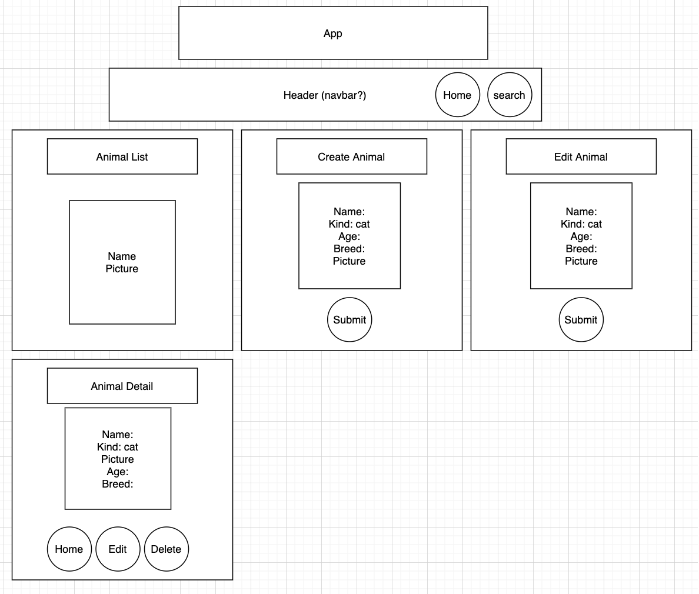

# **Urban Tails Shelter**

#### Author: **Celeste Field, Austin Butler, Chee Murakami**
#### July 20, 2020

#### https://urban-tails-shelter.herokuapp.com/ ####

### Description

_This application uses React with create-react-app, components, JSX, and a custom built API. This is a animal shelter site for cats, that will allow the user to select animals up for adoption and see their photos and save them to the database made with Rails and Postgres.(Rails API: https://afternoon-headland-99155.herokuapp.com/api/v1/animals/)_

## Setup/Installation Requirements

* _Clone Repository from GitHub : https://github.com/cheemurakami/urban_tails_shelter
* _Open folder in Virtual Studio Code (or your text editor of choice)_
* _Open your terminal in Virtual Studio Code & type code . this will open all files associated with this app. 
* _Before you initialize GIT, be sure to delete the already exisiting .git file by running this command in your terminal $rm -rf .git_
* _Create your own repository and push new changes to GitHub_

### Specs
|  Spec |  Input  | Output 
|---------|-------|--------
|**Show lists of cats from API**|**(load page)**|**Lucy, Kind:cat,Age:8,Breed:American Shorthair**|
|**Show pictures of cats from API**|**(load page)**|**Lucy, Kind:cat,Age:8,Breed:American Shorthair**|
|**User can search by breed**|**"sphynx"**|**Results with pictures**|
|**User can click the list and that navigates to AnimalDetail page**|**"click"**|**"show detail page"**|

## Known Bugs

_No known bugs at this time_

## Support and contact details

_If you have any questions or any issues please feel free to submit an issue here: kiwipom1031@gmail.com_

## Technologies Used

_JavaScript, React, Redux, Ruby on Rails_ 

### Licenses
*MIT LICENSE*

Copyright (c) 2020 **Celeste Field, Austin Butler, Chee Murakami**